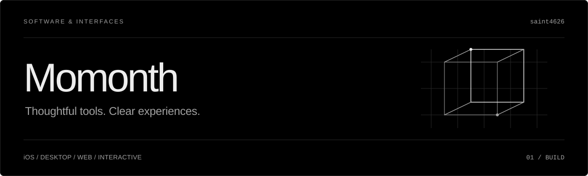

I build iOS and desktop apps, web interfaces, and interactive experiences, with a focus on performance, clear UX, and visual detail.

[Portfolio](https://momonth.tech/) · [X](https://x.com/VRMOMONTH)

## Current focus

- Native iOS apps with **Swift and SwiftUI**
- Cross-platform desktop tools with **Rust, Tauri, and Vue**
- Web interfaces and services with **TypeScript, Astro, and Go**
- Interactive worlds and tooling with **C#, Unity, and UdonSharp**
- Real-time applications with **Elixir, Phoenix, and LiveKit**

<strong>Explore my stack</strong>

### Languages
Swift · Rust · Go · TypeScript · C# · Elixir

### Interfaces & apps
SwiftUI · Vue · Astro · Tauri · Unity

### Backend & infrastructure
Phoenix · LiveKit · PostgreSQL · Docker · Linux

## GitHub activity

<a href="https://github.com/saint4626?tab=overview">
  <picture>
    <source media="(prefers-reduced-motion: reduce) and (prefers-color-scheme: dark)" srcset="https://raw.githubusercontent.com/saint4626/saint4626/output/github-contribution-grid-snake-dark-static.svg" />
    <source media="(prefers-reduced-motion: reduce)" srcset="https://raw.githubusercontent.com/saint4626/saint4626/output/github-contribution-grid-snake-static.svg" />
    <source media="(prefers-color-scheme: dark)" srcset="https://raw.githubusercontent.com/saint4626/saint4626/output/github-contribution-grid-snake-dark.svg" />
    
  </picture>
</a>

Based on my GitHub contribution calendar · refreshed daily · adapts to light, dark, and reduced-motion preferences.

View a static contribution snapshot

<picture>
  <source media="(prefers-color-scheme: dark)" srcset="https://raw.githubusercontent.com/saint4626/saint4626/output/github-contribution-grid-snake-dark-static.svg" />
  
</picture>

## Exploring

AI integration and on-device inference with **Core ML**.

Interested in real-time audio, on-device AI, and interactive graphics. I use AI-assisted development alongside code review and testing.

---

iOS · Desktop · Web · Interactive experiences · AI
